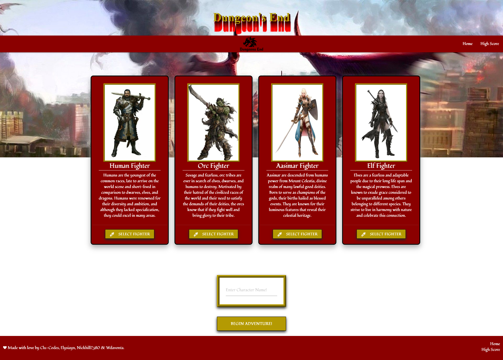

# Dungeon's End Fighting Game
### UCF Coding Boot Camp Project 1

## Purpose
The pandemic has forced many of us into isolation, preventing many adventures from gathering to embark upon legendary journeys with their friends. Thus, Dragon's End was born. Now, you can play your favorite role-playing game wherever & whenever you desire as long as you have an internet connection! Fight against many of your favorite D&D monsters and challenge your friends to beat your high score. 

## Instructions
1. User deployes production. 
2. Once loaded, user is presented 4 Fighter options to choose from. User must select corresponding "Select Fighter" button directly under fighter race description.
3. Under the fighter selection portion will be an input field with faded text "Enter Character Name!". User will type in desired character name here.
4. Once character name is entered, user is to press the "BEGIN ADVENTURE!" button directly under. User may also choose press the "Enter" key on their keyboard instead. 
5. A new page will appear and the user will be connected to the combat phase once they click "CONTINUE" button.
6. User selected fighter will be displayed against API generated monster. The combat log to the left will display combat interaction as combat progresses. A selection of 4 combat option buttons will be directly underneath. User will have the ability to perform one of the four options:
    * Attack: Deal damage to enemy monster. If enemy is deafeted, a new foe will be automatically generated(expierence points(XP), will be awarded to fighter).
    * Run: Run away from current encounter. This option slightly dimninishes the ability to successfully run away per use. Automatically generates a new foe.
    * Dodge: Decreases chance of enemy monster landing a hit and dealing damage to fighter. 
    * Health: Heals fighter for 10 health points(HP). Fighters are provided 5 potions, 1 is consumed per use.
    After selecting combat option, enemy monster will attempt to deal damage to fighter. 
7. User will be able to read the result of their combat choices on the combat log as they click on their action. 
8. The game ends once the fighter is dealt damage that excedes their current health points(HP). 
9. User will then be automatically directed to a "High Scores" page where they will be able to see and compare their results against previous attempts(if played more than once). 

## Features
* Interactive elements(buttons, input fields): Gives users elements to interact with, such as character selection, name input, and fight button options. 
* Utilizes local storage to store user selections and inputs. 
* Utilizing local storage to create competitiveness amongst players by ranking scores on high scores page. 
* Dynamic playability via user option sets. 
* Follows Dungeon's and Dragons 5e game mechanics(combat options), monster details for encounters pulled from Open 5e API and DnD 5e API. 

## Built With
Languages Used: HTML, CSS & Materialize, & JavaScript

## Deployed Production Link
[Dungeons-End](https://elysiayn.github.io/dungeons-end/)

### Contributions
* [Connor Cluster](https://github.com/Clu-Codes)
* [Nick Hill](https://github.com/Nickhill2380)
* [Da'Vonta Williamson](https://github.com/wdavonta)
* [Wendy Lemus](https://github.com/Elysiayn)